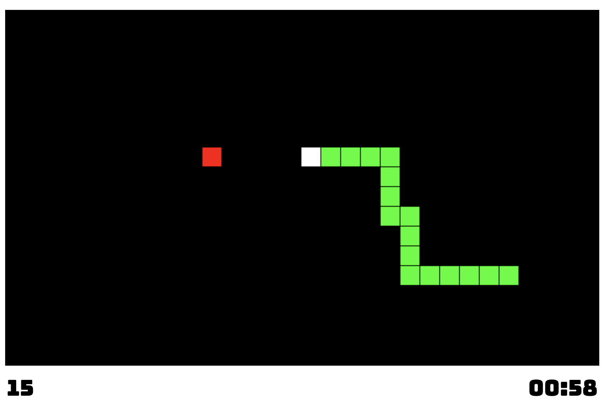

# Simple Retro Snake Game in HTML

This is the basic implementation of the retro snake game. The implementation does not require a lot of code. Maybe there are few missing things and you are free to improve it.

The game's source code contains these JavaScript classes: Grid, Snake, Game.

- The Grid class represents the area that the actual game artifacts are drawn.
- The Snake class represents the snake and has a logic for the snake object.
- The Game class contains the main logic of the game such as score, timer etc.

## License

You are free to use this code in any project, commercial or not. There is no need to ask for permission.

## What it looks like

